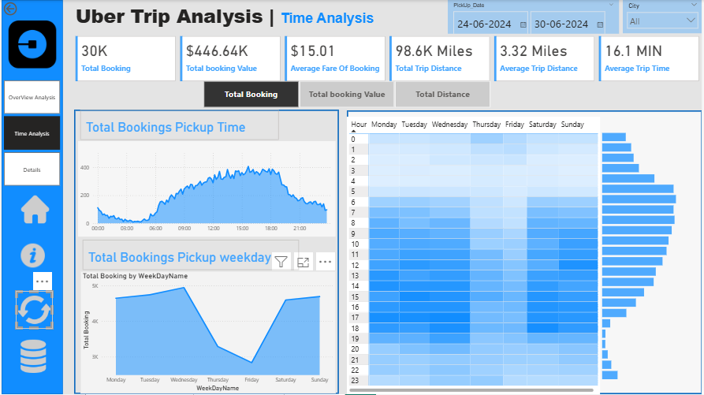
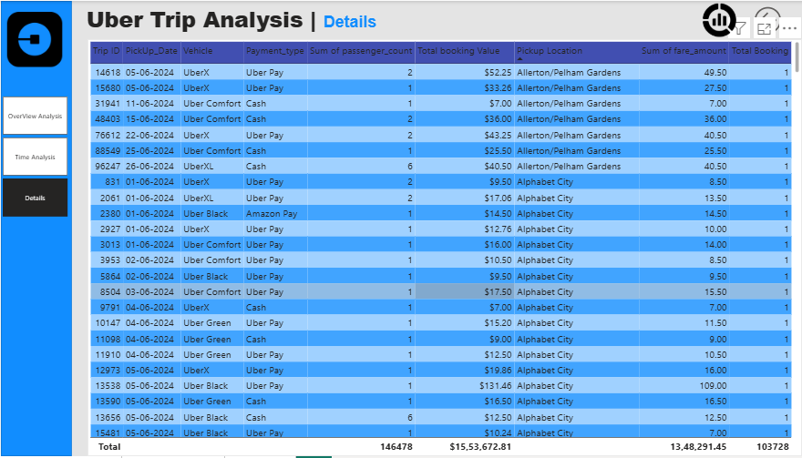

 📊 Dashboards
🎥 Interactive Dashboard Demo (GIF)

This GIF demo shows the interactive features of the Uber Trip Analysis Dashboard in action.
It highlights how users can:

Filter trips by date and city.

Switch between different KPIs (Bookings, Revenue, Distance).

Explore dynamic charts and drill-through views.

Instantly update all visuals based on user selections.

🗂️ Overview Analysis

Key KPIs: Total Bookings, Total Revenue, Average Fare, Trip Distance, Average Trip Time.

Breakdown of bookings and revenue by payment type and trip type (Day/Night).

Vehicle Type Analysis (UberX, Comfort, Black, XL, Green) with bookings, revenue, average fare, and distance.

Top Pickup & Drop-off Locations for demand hotspots.

Farthest Trip Analysis to identify long-distance demand.

⏰ Time Analysis – Bookings by Time

Displays booking distribution across 10-minute intervals throughout the day.

Line chart shows daily ride demand trends.

Heatmap visualizes hourly demand across weekdays vs. weekends.

Helps identify peak and off-peak periods.

⏰ Time Analysis – Revenue & Distance
 

Revenue Analysis: Tracks booking value across time of day and weekdays.

Distance Analysis: Monitors trip distances by pickup time and weekday patterns.

Heatmaps highlight demand intensity by hour and weekday.

Supports better driver allocation and pricing strategies.

📑 Details Tab

Grid view of trip-level data with fields:

Trip ID, Date, Vehicle, Payment Type, Passenger Count, Fare, Distance, Pickup Location.

Drill-through functionality allows users to explore details from higher-level visuals.

Enables exporting raw data for further offline analysis.

Useful for auditing, reporting, and operational insights.
